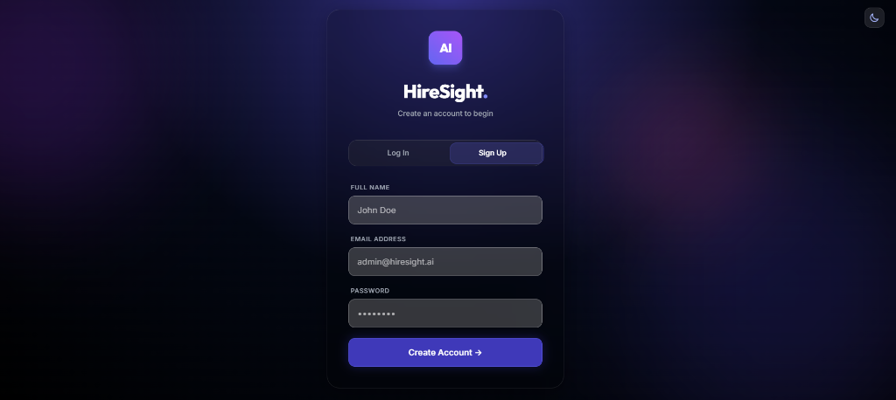
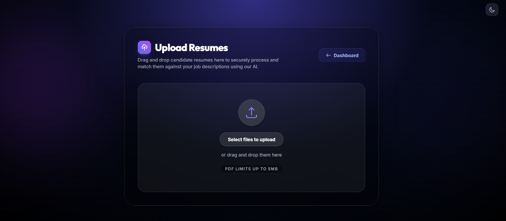
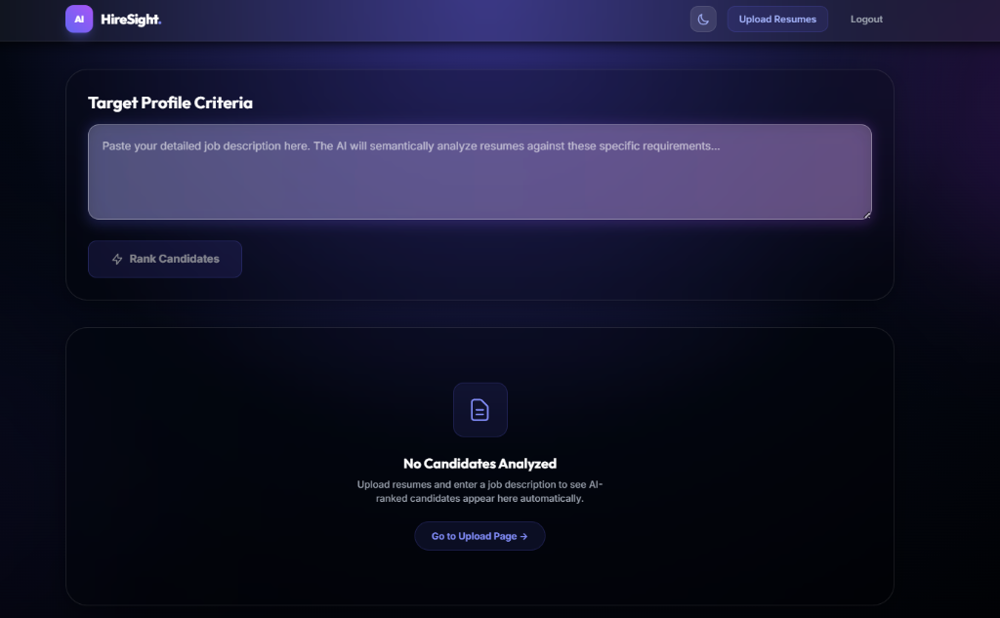
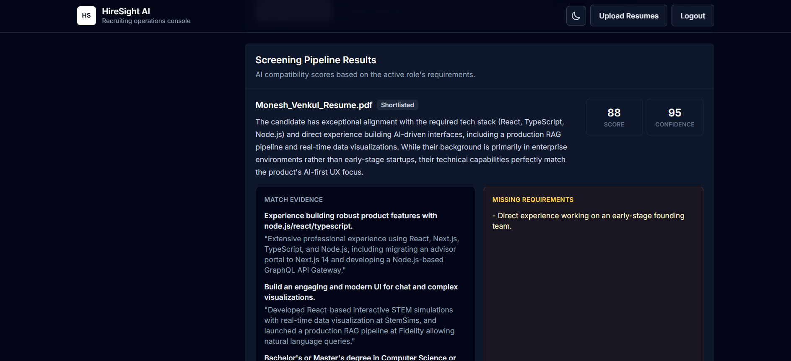
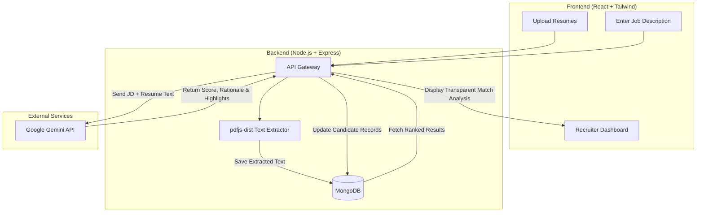
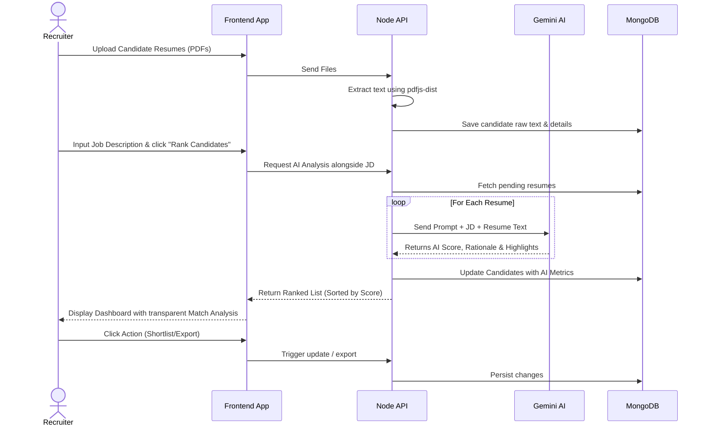

# HireSight AI 🚀

HireSight AI is an intelligent, modern applicant tracking and resume ranking platform built to streamline the hiring process.

## ⚠️ The Problem

The traditional hiring process is time-consuming and often biased. Recruiters receive hundreds of resumes for a single job posting, making it nearly impossible to manually review each one thoroughly. Key skills and qualified candidates often slip through the cracks, while a significant amount of time is wasted reading irrelevant applications. Furthermore, the lack of transparency in why a candidate is selected or rejected can lead to poor candidate experiences and biased hiring decisions.

## 💡 The Solution

HireSight AI automates the initial screening phase by semantically analyzing candidate resumes against a provided Job Description (JD). Utilizing advanced Large Language Models (LLMs), the platform assigns a compatibility score to each candidate based on their match to both technical and non-technical requirements.

Beyond simply scoring, HireSight AI provides crystal-clear, AI-generated rationales and highlights precisely *why* a candidate was shortlisted or rejected. This allows recruiters to make faster, fairer, and data-backed decisions effortlessly.

---

## 📸 Screenshots





  


---

## 🏗️ System Architecture



## ⚙️ User Workflow



## ✨ Features

- **Automated Resume Parsing**: Securely upload resumes (PDF) and let the application extract the core information reliably using `pdfjs-dist`.
- **Semantic Ranking**: Paste your technical and non-technical Job Description. The integrated Google Gemini AI model creates a detailed summary and ranks applicants dynamically.
- **Transparent Match Analysis**: The system provides a custom "Selection Rationale" and explicit "Match Highlights", showing recruiters exactly *why* a candidate was selected by mapping resume snippets directly to JD requirements.
- **Premium User Experience**: Designed with modern web aesthetics in mind, featuring responsive light and dark mode toggles, styling with Tailwind CSS, glassmorphic cards, and smooth CSS micro-animations.
- **Actionable Insights**: Export candidate reports directly to CSV, sort top applicants globally, and seamlessly update application statuses.
- **Secure Handling**: JWT Bearer token authentication integrated at the Axios interceptor level, coupled with robust React Router route protection. 
- **Cloud Deployment Ready**: Pre-configured for easy deployment. Frontend is optimized for Vercel, and backend is optimized for Render, handling dynamic environment-specific base URLs and robust file uploads.
- **Docker & CI/CD Pipeline**: Fully containerized using continuous integration pipelines with GitHub Actions. It includes Nginx to securely serve local builds, multi-stage Vite optimisations, and a unified `docker-compose.yml` to spin up everything with a single command.

## 🛠️ Technology Stack

- **Frontend**: React.js, Vite, Tailwind CSS v3, React Router DOM, Axios
- **Backend**: Node.js, Express.js
- **Database**: MongoDB / Mongoose
- **AI Integration**: Google Gemini API for advanced NLP logic
- **File Parsing**: `pdfjs-dist` for robust PDF text extraction
- **Authentication**: Custom JSON Web Tokens (JWT) & bcrypt
- **DevOps & CI/CD**: Docker, Docker Compose, Nginx, GitHub Actions

---

## 🏎️ Quickstart Guide

Getting the application running locally is extremely straightforward.

### 1. Prerequisites
- Node.js (v16+)
- MongoDB Atlas cluster or local MongoDB instance
- Google Gemini API Key

### 2. Environment Setup

**Backend Configuration:**
Navigate to the `Backend` directory and duplicate `.env.example` into a new `.env` file:
```bash
cd Backend
cp .env.example .env
```
Fill out the variables in `.env` with your actual MongoDB URI, a secure JWT Secret, and your Google Gemini API Key (e.g., `GEMINI_API_KEY`).

**Frontend Configuration:**
Navigate to the `Frontend` directory and ensure the `.env` file is pointing to your local (or production) backend API:
```bash
cd ../Frontend
cp .env.example .env
```
*(Default is `http://localhost:5000/api`)*

### 3. Installation & Running

Open two terminal windows (one for the Backend, one for the Frontend).

**Terminal 1 (Backend):**
```bash
cd Backend
npm install
npm start
```
*The API will start on `http://localhost:5000`*

**Terminal 2 (Frontend):**
```bash
cd Frontend
npm install
npm run dev
```
*The Vite development server will open instantly on `http://localhost:5173`*

---

## 🐳 Docker Deployment

You can quickly spin up both the Frontend and Backend services in isolated containers using Docker Compose.

1. Ensure **Docker** and **Docker Compose** are installed and running on your system.
2. Create your `.env` files in the `Backend` and `Frontend` directories as detailed in the Quickstart Guide.
3. Run the following command from the root directory:

```bash
docker-compose up --build
```

The application will build the backend Node.js server (`http://localhost:5000`) and compile the Vite frontend serving it statically via Nginx (`http://localhost:80`). Continuous Integration checks are also automated via GitHub Actions on every push/PR to the `main` branch.

---

## 🔒 Security & Architecture Notes
- **Interceptors**: The application uses Axios interceptors to persistently attach Bearer tokens. If a token expires (401 response), the system unconditionally clears local storage and cleanly kicks the user back to the login gateway.
- **Protected Routes**: React Router handles protected routing globally. Unauthenticated users cannot peek at `/dashboard` or `/upload` paths.
- **Deployment**: Architecture ensures seamless communication between frontend (Vercel) and backend (Render).

- [](https://github.com/NileshKonkankar/hiresight-ai/actions/workflows/ci.yml)

*(This application was continuously refined with AI automation to be completely production-ready.)*
